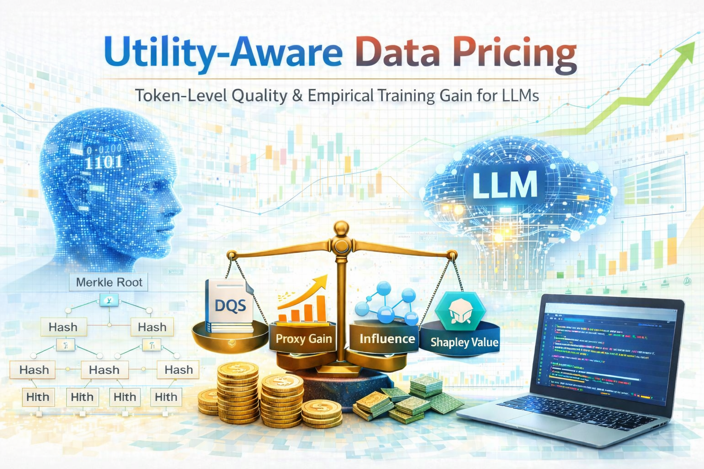

<div align="center">

# 基于效用的数据定价

**面向LLM的词元级质量与训练增益的数据定价**

<p>
  
</p>

<p>
  
  
  <a href="https://github.com/BDS-SDU/utility-aware-data-pricing/graphs/commit-activity" target="_blank">
    </a>
  <a href="https://github.com/BDS-SDU/utility-aware-data-pricing/issues?q=is%3Aissue%20is%3Aclosed" target="_blank">
    </a>
  
</p>

<p>
  简体中文 | <a href="./README.md">English</a>
</p>

</div>

> **一句话概述：** 一种动态数据估值框架，超越静态的"行数×质量系数"定价范式，转向基于效用的定价——融合词元级Shannon熵指标、经验训练增益（影响函数、代理模型、Data Shapley）与密码学可验证性（Merkle树、哈希承诺）——使数据能够按其对LLM智能的实际贡献进行定价。

本文是效用感知数据定价论文的官方实现，提出了一种基于词元级文档质量评分与经验训练增益估计相结合的训练数据价值评估框架。

## 概述

本框架通过四个互补的估值信号对训练数据源进行定价：

- **文档质量评分 (DQS)** — 基于n-gram参考模型，在词元级别衡量信息密度、语法连贯性和语义丰富度。
- **代理增益 (Proxy Gain)** — 通过快速代理模型（哈希逻辑回归）的改进程度估计每个数据源的效用。
- **影响力评分 (Influence Score)** — 量化模型对每个数据源包含的敏感度。
- **沙普利值 (Shapley Value)** — 通过蒙特卡洛采样近似计算每个数据源的边际贡献。

这些信号经过归一化后，以可配置的权重集成统一的评分。**训练证明账本 (Proof-of-Training Ledger)** 记录不可变的参数承诺和Merkle根，以确保验证性和可审计性。

## 仓库结构

```
utility-aware-data-pricing/
├── data_pricing/              # 核心库
│   ├── __init__.py            # 包导出
│   ├── data_types.py          # DocumentRecord, DocumentScore, SourceScore, ValuationReport
│   ├── pipeline.py            # DynamicDataValuationPipeline（主流程编排器）
│   ├── quality.py             # DQS：n-gram模型、信息密度、语法/语义评分
│   ├── valuation.py           # ProxyEvaluator：哈希文本逻辑回归
│   ├── shapley.py             # 蒙特卡洛Shapley值近似
│   ├── verification.py        # 训练证明账本（Merkle根、哈希链）
│   ├── real_datasets.py       # 真实数据集定义（Alpaca, GSM8K, CodeXGLue）
│   ├── demo_data.py           # 合成演示数据生成器
│   └── io_utils.py            # JSONL/CSV/JSON I/O 工具
├── scripts/                   # 所有可运行脚本
│   ├── run_valuation.py                           # 运行估值流水线
│   ├── run_experiments.py                         # 排序、鲁棒性与消融实验
│   ├── run_real_multidomain_experiments.py        # 真实多领域实验
│   ├── plot_results.py                            # SVG可视化
│   ├── plot_real_multidomain_matplotlib.py        # Matplotlib论文级图表
│   ├── export_latex_figures.py                    # 导出PDF图表用于LaTeX
│   ├── generate_demo_data.py                      # 生成演示JSONL文件
│   └── download_dataset.py                        # 从Hugging Face下载真实数据集
├── assets/                    # 静态资源
│   └── readme_fig.png         # README封面图片
├── data/                      # 训练和验证数据 (JSONL，不纳入版本控制)
└── outputs/                   # 生成的报告、图表和表格（不纳入版本控制）
    ├── figures/               # SVG、PDF、PNG图表
    └── tables/                # CSV结果表格
```

## 安装

本实现为纯Python，依赖极少：

```bash
pip install datasets numpy matplotlib
```

> 无需编译扩展。代理模型和n-gram评分器均从零实现，确保完全可复现。

## 快速开始

### 1. 在演示数据上运行估值

```bash
python scripts/run_valuation.py
```

在合成演示数据上运行完整的估值流水线。输出保存至 `outputs/`：
- `valuation_report.json` — 完整估值报告
- `tables/valuation_source_scores.csv` — 按数据源的评分（DQS、代理增益、影响力、Shapley值、统一评分）
- `tables/valuation_document_scores.csv` — 按文档的质量指标

自定义数据路径：

```bash
python scripts/run_valuation.py --train data/my_train.jsonl --val data/my_val.jsonl --output outputs/my_report.json
```

### 2. 运行实验（排序、鲁棒性、消融）

```bash
python scripts/run_experiments.py
```

对比所有估值方法与真实训练增益的差异，通过相关性分析学习最优集成权重，并执行鲁棒性（噪声复制攻击）和消融（逐信号剔除）研究。输出：
- `outputs/experiment_report.json`
- `outputs/tables/ranking_metrics.csv`
- `outputs/tables/source_estimators.csv`
- `outputs/tables/learned_weights.csv`
- `outputs/tables/robustness.csv`
- `outputs/tables/ablations.csv`

### 3. 真实多领域实验

首先下载真实数据集：

```bash
python scripts/download_dataset.py
```

然后运行多领域实验：

```bash
python scripts/run_real_multidomain_experiments.py
```

该实验在三个领域——通用指令（Alpaca）、数学推理（GSM8K）和代码摘要（CodeXGLue）——上进行估值评估，生成各领域和跨领域的结果。

参数选项：

```bash
python scripts/run_real_multidomain_experiments.py \
  --datasets alpaca_instruction gsm8k_math codexglue_python \
  --train-limit-per-domain 120 \
  --shapley-iterations 32 \
  --seed 17
```

### 4. 生成图表

```bash
# SVG图表
python scripts/plot_results.py

# 论文级PDF/PNG图表（需要matplotlib）
python scripts/plot_real_multidomain_matplotlib.py
```

所有图表保存至 `outputs/figures/`。

## 输入数据格式

训练和验证数据采用JSONL格式，每行为一个JSON对象：

```json
{"doc_id": "doc_001", "source_id": "source_a", "text": "文档内容...", "label": 0}
```

| 字段       | 说明                                    |
|-------------|------------------------------------------------|
| `doc_id`    | 唯一文档标识                     |
| `source_id` | 文档所属数据源            |
| `text`      | 文档文本内容                          |
| `label`     | 整数标签（代理模型使用）            |

## 流水线配置

`DynamicDataValuationPipeline` 接受两个关键权重元组：

| 参数            | 默认值              | 说明                                     |
|----------------------|----------------------|-------------------------------------------------|
| `dqs_weights`        | `(0.4, 0.3, 0.3)`   | （信息密度、语法、语义）的权重 |
| `ensemble_weights`   | `(0.25, 0.35, 0.2, 0.2)` | （DQS、代理、影响力、Shapley）的权重 |
| `ngram_order`        | `3`                  | 参考语言模型的n-gram阶数   |

## 数据集

| 数据集 | 领域 | 来源 |
|---------|--------|--------|
| Alpaca | 通用指令跟随 | `tatsu-lab/alpaca` |
| GSM8K | 数学推理 | `openai/gsm8k` |
| CodeXGLue Python | 代码摘要 | `google/code_x_glue_ct_code_to_text` |


## 免责声明

本仓库为**研究原型**，仅供学术研究和教育目的使用，**不适用于生产或工业场景**。

## 许可证

本项目基于 [MIT License](LICENSE) 许可。
